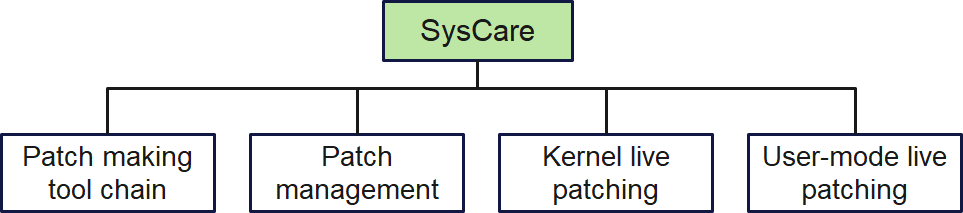

# Introduction to SysCare

## Overview

SysCare is an online live patching tool that automatically fixes bugs and vulnerabilities in OS components, such as kernels, user-mode services, and dynamic libraries. 

## SysCare Functions

SysCare supports live patching for kernels and user-mode services:

1. One-click creation
    SysCare is a unified environment for both kernel- and user-mode live patches that ignores differences between patches, ensuring they can be created with just one click.
2. Patch lifecycle operations
    SysCare provides a unified patch management interface for users to install, activate, uninstall, and query patches.

## SysCare Technologies

1. Unified patches: SysCare masks differences in detail when creating patches, providing a unified management tool to improve O&M efficiency.
2. User-mode live patching: SysCare supports live patching of multi-process and multi-thread services in user mode, which takes effect when a process or thread is started or restarted.
3. Lazy mechanism: SysCare fixes the ptrace defect (all kernel calls are ended) and improves the fix success rate.
