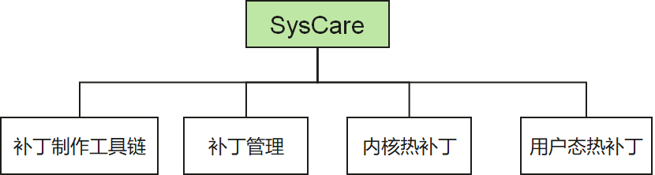

# 认识SysCare

## 简介

SysCare是一个操作系统热补丁服务，统一了操作系统内核态、用户态热补丁服务。为操作系统提供在线的热补丁修复能力，可以自动化、无感知地在线修复内核、用户态服务、动态库等系统基础组件bug和漏洞。

## SysCare系统功能

SysCare提供补丁制作、补丁激活和补丁卸载等功能，支持内核热补丁、用户态热补丁制作和管理：

1. 一键式补丁制作能力
   目前SysCare统一内核热补丁和用户态热补丁的制作流程，提供一键制作补丁能力，对用户屏蔽制作补丁细节及用户态、内核态补丁制作差异。

2. 补丁安装、激活、卸载
   SysCare提供统一补丁管理接口，方便用户在补丁安装、激活、卸载查询使用。

## SysCare系统技术

1. SysCare归一化补丁制作，对用户屏蔽补丁制作的细节及差异，提供统一的补丁管理工具，提升运维效率。
2. SysCare提供的用户态热补丁支持在用户态多进程/多线程业务热修复，具有修复简单的特点，能够提升运维效率；在进程/线程新拉起、重启均生效。
3. 热补丁lazy机制，克服`ptrace`缺陷（需全部退出内核调用），提升修复成功率。
